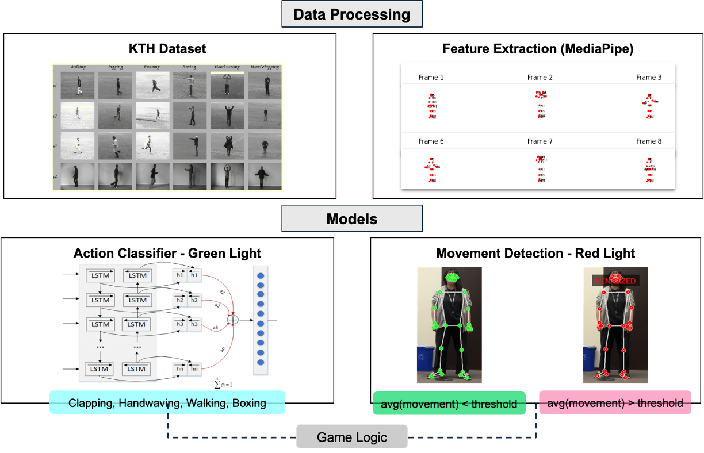
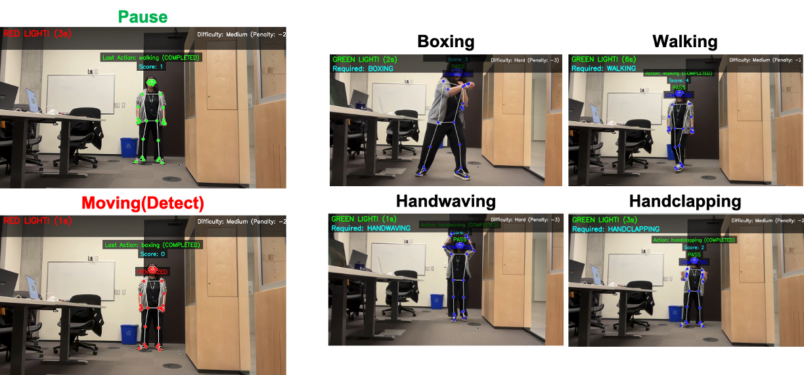

# [MIE1517] Project-YoungHee (Team 20)

This project implements an AI-powered version of the popular "Red Light, Green Light" game (also known as "YoungHee" game), inspired by the one seen in the series "Squid Game." The system uses computer vision and machine learning to detect player movements and specific actions.



## Overview
YoungHee is an interactive game that combines real-time pose detection using MediaPipe with action recognition using deep learning. The game alternates between "Red Light" and "Green Light" phases:

During Green Light: Players must perform a specific action (boxing, handclapping, handwaving, or walking) to earn points
During Red Light: Players must remain still, or they'll be penalized

## Features
Real-time pose detection using MediaPipe
Custom-trained deep learning model (Bidirectional LSTM with attention mechanism) for human action recognition
Three difficulty levels (easy, medium, hard)
Visual feedback on player performance
Score tracking system

## Requirements
Python 3.12
PyTorch
OpenCV
MediaPipe
NumPy
Matplotlib
tqdm
scikit-learn

## Usage
The game has three main components: data preparation, model training, and gameplay.

### Preparing the Data
```
python main.py --prepare
```
This will download and process the KTH action recognition dataset, extracting pose features using MediaPipe.

### Training the Model
Trains a Bidirectional LSTM model with attention mechanism on the processed data. You can customize training parameters:
```
python main.py --train --epochs 60 --batch-size 32 --learning-rate 0.0001
```

### Playing the Game
Launches the game using your webcam. You can set the difficulty level:
```
python main.py --play --difficulty easy --model-path "SPECIFY CUSTOM PATH"  # Options: easy, medium, hard
```

Game Controls
- q: Quit the game


## How the Game Works
1. The game alternates between "Red Light" and "Green Light" phases
2. During "Green Light," a random action is assigned (boxing, handclapping, handwaving, or walking)
3. The player must perform the required action to earn points
4. During "Red Light," the player must remain still
5. If movement is detected during "Red Light," points are deducted based on difficulty level


## Model Architecture
The action recognition model uses a Bidirectional LSTM with attention mechanism:
- Input: Sequence of normalized pose coordinates
- Hidden layers: 2-layer BiLSTM with 128 hidden units
- Attention layer: Helps focus on the most relevant frames
- Output: Classification into one of the four action classes


## Example of implementation



## References
- Kang, S. M., & Wildes, R. P. (2016). Review of action recognition and detection methods. arXiv preprint arXiv:1610.06906. https://www.csc.kth.se/cvap/actions/
- Zhou, Q., & Wu, H. (2018, October). NLP at IEST 2018: BiLSTM-attention and LSTM-attention via soft voting in emotion classification. In Proceedings of the 9th workshop on computational approaches to subjectivity, sentiment and social media analysis (pp. 189-194).
